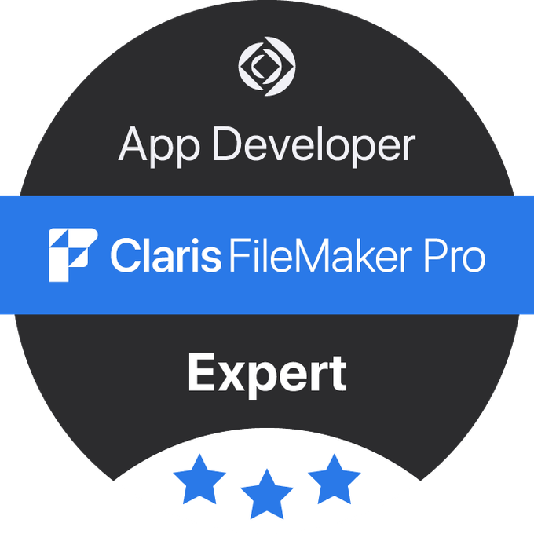

    <h1>👋 Hi there!</h1>
    <h2>I'm Dean, welcome to my profile :)</h2>

## About me
I love math, philosophy, fiction and basically any type of science, learning is awesome and I never wish to stop!

Though my deteriorating eyesight has made it a struggle, I still try to read as much as I can, with my favorite genres being psychological/philosophical horror and complex mysteries. 
I absolutely loved **Think of a Number by John Verdon** and its sequels, got any similar suggestions for me?

## Development
I lean toward backend, but have worked some on the front. 
I believe cyber-security should be learned by any programmer, and categorized as a top priority every. step. of the way. 
Love Git and Docker, and someitmes hang out in their forums on my free time.

I'm a fast learner who's constantly fidgeting around testing out different systems, frameworks, etc. 
That being said, I do know the importance of strengthening your bases, as just randomly learning a bit of everything is not enough.

As someone who worked with low-code systems for quite a few years:
- Low-Code development is still software development! It can be just as complex, and when working around restricted systems, even tougher.
- I'm no "mere developer", with experience in both low-code frameworks and traditional pro-code, I can say I'm a strong **All-Rounder!**

I have experience with software development, web hosting, network management, software, and a bit of hardware repairs. 
Whatever you're working on, I may be able to join, or at least, I can promise to catch up **rapidly**.

## Career
I started my programming journey back in 2013, learned the basics from my father, and quickly took over his projects. 
I worked freelance, selling content management systems specifically tailored to my clients' needs, using my father's business as proxy.

Most my works were based on [Claris FileMaker](https://www.claris.com/filemaker/), and so, I have quite a bit of experience with relational databases.

Being the sole developer, I was responsible for client communications, system design, graphics, development, networking, security, upkeep, server management, and tech support. 
It was a lot, and I'm glad for it!

In the army, medical complications have prevented my assignment to a cyber unit, and so I was sent to manage the networks and IT repairs for the Gaza division of the IDF. During my service I have undergone a network administration course and received a Windows technician's certificate (which I need to find 😅).

Today, I'm working part-time for one of my clients, releasing new features, upgrading their servers, managing their networks, securing vulnerabilities - Definitely still developing software, but doing a whole lot more around it.

## Contact Me!
Feel free to contact me for any reason, including:
- Instructions, explanations and help
- Code recommendations and feature requests
- Collaborations - **Invite me to your projects**, I'm constantly looking for something new to work on :)
- Hiring - As of the current commit, I am [looking for a job](https://github.com/deanayalon/deanayalon/tree/main/files/Resumé.pdf)!

 

## Technologies Used:
- **Languages:** JavaScript, TypeScript, C# .NET, Python, Shell
- **Backend:** Node, NestJS, Deno
- **Databases:** MongoDB, FileMaker, SQL
- **Frontend:** Angular, Wix Velo/SDK
- **Low-Code**: FileMaker Pro/Server, Wix (no longer really low-code on the backend)
- **CVS:** Git, GitHub, GitLab, Azure DevOps, Self-hosted OneDev, Git LFS
- VSCode
- **DevOps:** Docker, [Devin.fm](https://devin.fm), GitHub Actions
- **Code Security:** GitGuardian, Snyk, Docker Scout
- **Graphic Design:** Adobe PhotoShop, Illustrator

## Currently Learning
- Test Driven Design
- Deno
- C/++

## Certifications

## Thanks
- [evab](https://github.com/eranbraun) For continuous guidance and support through my constant nagging
